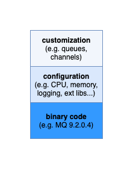

# Git your MQ: Tutorial 1

This repository is the first in a set of progressive tutorials that shows you
the benefits of managing your IBM MQ queue managers using DevOps on the
Kubernetes platform. This tutorial assumes that you have a basic knowledge of
MQ, but are new to DevOps and/or Kubernetes.

In this first tutorial we learn about:

- [Git your MQ: Tutorial 1](#git-your-mq-tutorial-1)
  - [The structure of a queue manager](#the-structure-of-a-queue-manager)
  - [How to define your queue manager as code](#how-to-define-your-queue-manager-as-code)
  - [Installing `Minikube` Kubernetes](#installing-minikube-kubernetes)
  - [Running your queue manager in Kubernetes](#running-your-queue-manager-in-kubernetes)
  - [Next Tutorial](#next-tutorial)

At the end of this turotial, you'll have your own queue manager, defined in
`git` running in a Kubernetes cluster on your local machine.

---

## The structure of a queue manager

Whenever we first create a new queue manager, we start by installing some IBM
provided binary code on our local operating system. We can then use the `crtmqm`
command (with its associated `qm.ini` file) to create an instance of a queue
manager. Once created, we can use the `runmqsc` CLI to customize it with the
queues, channels and other MQ artefacts required by connected applications.

We can represent a queue manager instance like this:

{width="800" height="600" align="center"}

The structure of a queue manager instance

Let's use this conceptual model to manage a queue manager.

---

## How to define your queue manager as code

Let's define your queue manager in GitHub. We'll quickly see the advantages this brings.

1. Create a sample queue manager repository in your GitHub
   account](https://github.com/)

    To help you get started, here's a [template
    repository](https://github.com/ODOWDAIBM/gityourmq-01) you can use. Using a
    template is just like a regular forked copy, but with a fresh history. If
    you're new to GitHub, read about [repository
    templates](https://docs.github.com/en/repositories/creating-and-managing-repositories/creating-a-repository-from-a-template).

2. Clone repository to your local machine

   Now that you have your own fork of this repository, clone it to your local
   machine to exmaine it.

   Open a terminal window. To make it easy to work with your GitHub account from
   your local machine, set up the following environment variable:

   ```
   export GITUSER=<Your GitHub userID>
   ```

   It's popular to clone your GitHub repositories to a common folder on your local
   file system, such as `/git`.

   ```
   cd $HOME/git
   git clone git@github.com:ODOWDAIBM/gityourmq-01.git
   cd gityourmq-01
   ```

   If you're new to GitHub, read about [cloning a
   repository](https://docs.github.com/en/get-started/quickstart/fork-a-repo#cloning-your-forked-repository).

3. Show the repository structure

   From the terminal, issue the following command:
   ```
   tree .
   ```
   to show the structure of the queue manager repository:

   ```
   .
   ├── Dockerfile
   ├── LICENSE
   ├── README.md
   └── docs
       └── images
           ├── diagram1.drawio
           └── diagram1.drawio.png
   ```

   Note that it's a very simple structure:

   - `Dockerfile`: Defines the queue manager structure; we'll examine in detail later.
   - `LICENSE`: A permissive MIT licence; please feel free to use this
      repository as a basis for your own work.
   - `README.md`: This tutorial text.
   - `docs`: Documentation for this tutorial.

You should follow this practice; most importantly, use markdown, `README.md`
files and documentation to help describe the queue manager stored in a repository.

---

## Installing `Minikube` Kubernetes

Install Kubernetes

---

## Running your queue manager in Kubernetes

Run your queue manager

---

## Next Tutorial

Look out for the next tutorial in this series.